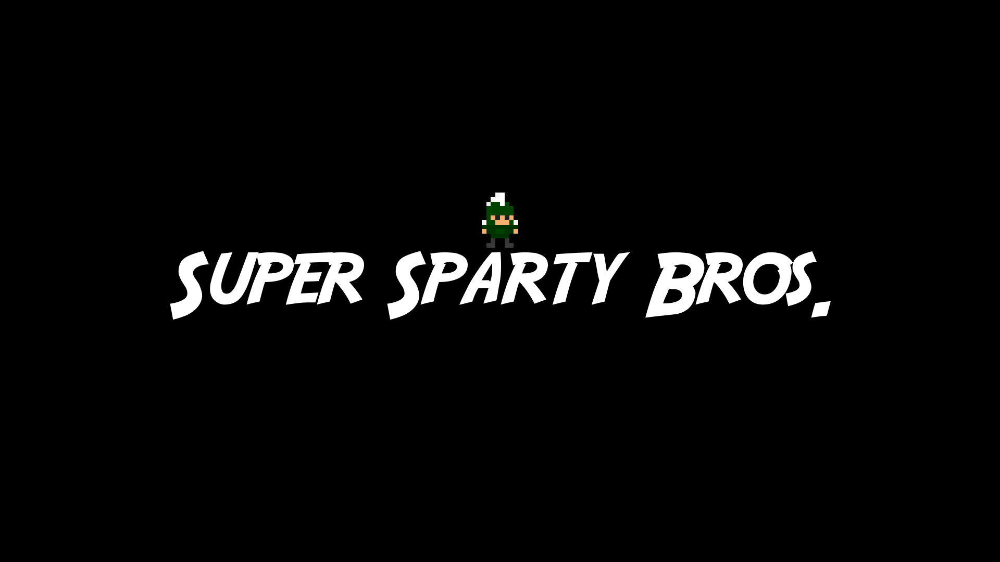
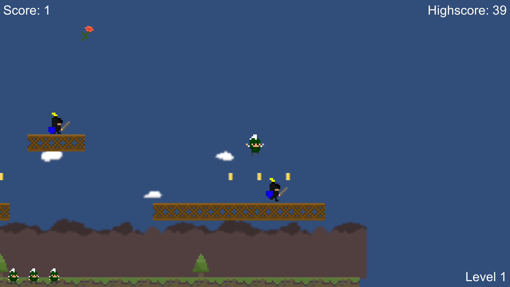
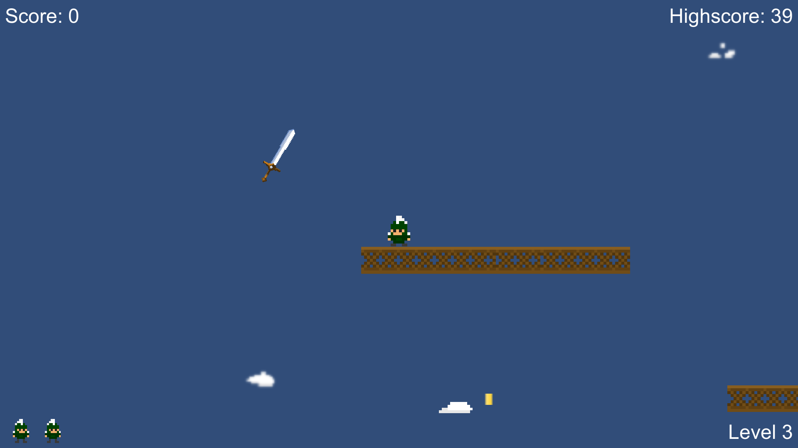
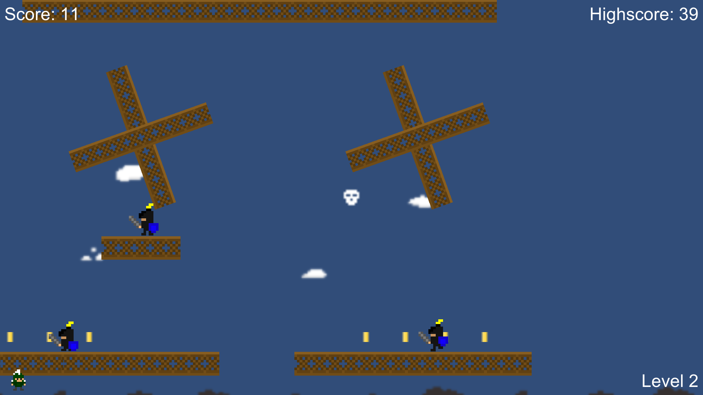
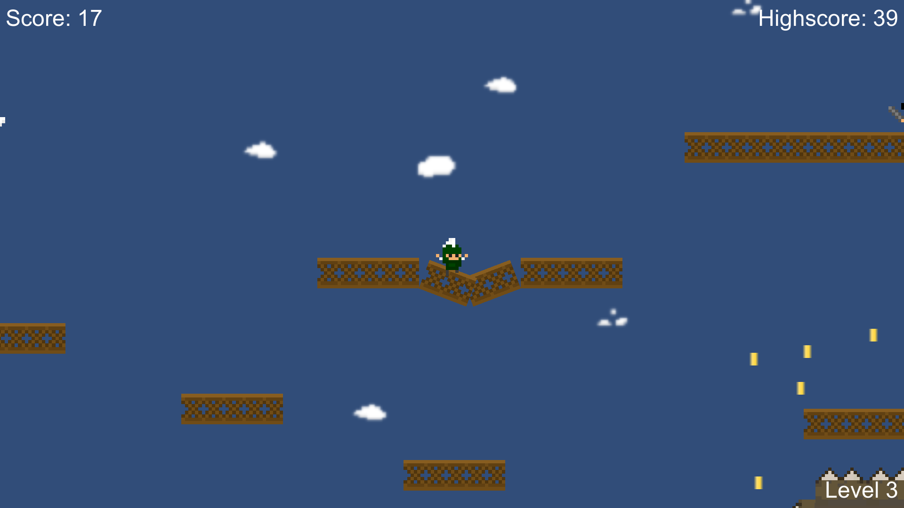
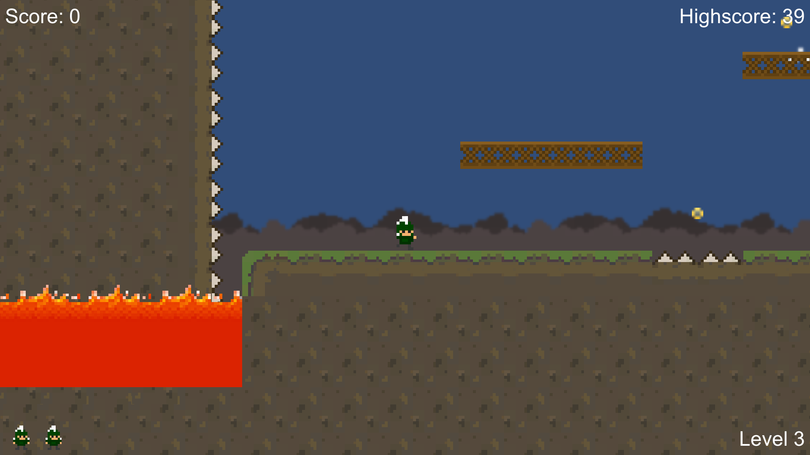
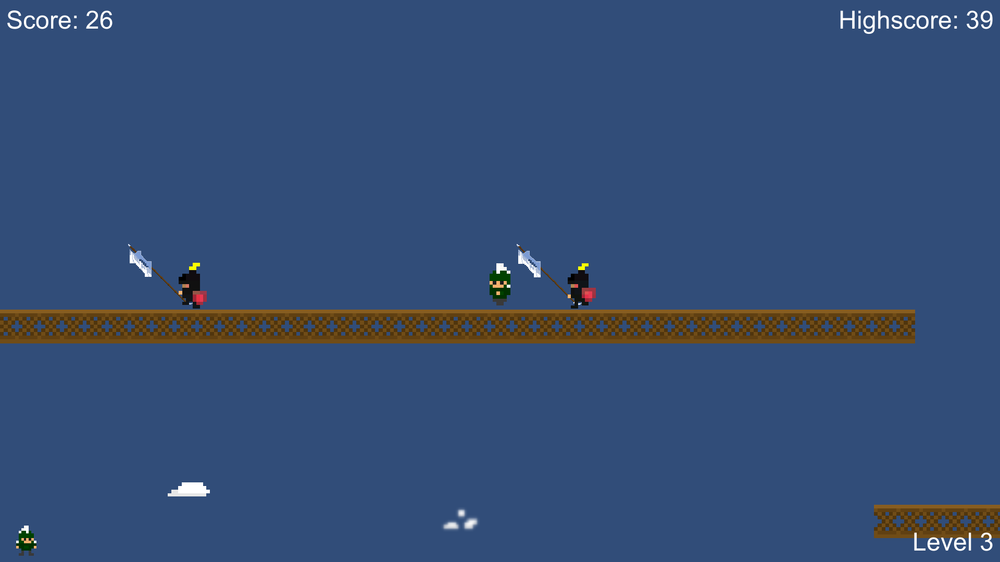
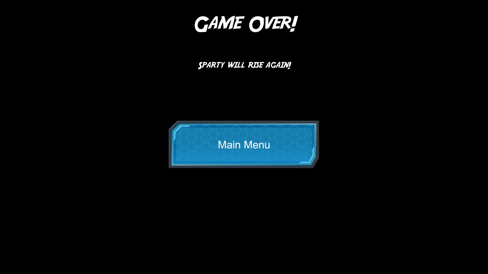

# SuperSpartyBros
Collect coins, avoid enemies, and go for the Sword!

The objective of the game is to progress through levels by defeating enemies, collecting items and solving puzzles without dying. It involved using the college mascot as the main character. The game was created as a project under the  “Game Development For Modern Platforms “  in the Game Design and Development specialization course in coursera. 

1. Added a new platform with a trap mechanic.
2. Altered an enemy to create a new enemy skin.
3. Added a weapon to the new enemy.
4. Added a new level.
5. Added spokes and rotating platforms.

### Link ( playable in Browser)
https://av217.itch.io/superspartybros

