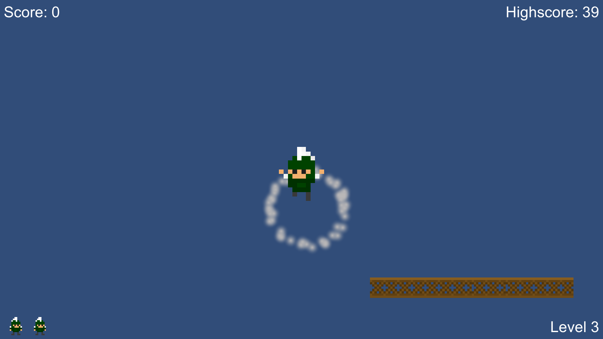

# SuperSpartyBros
Collect coins, avoid enemies, and go for the Sword!

The objective of the game is to progress through levels by defeating enemies, collecting items and solving puzzles without dying. The player plays as Sparty the college mascot. The game was created as a project under the  “Game Development For Modern Platforms “  in the Game Design and Development specialization course in coursera. 

### Link ( playable in Browser)
https://av217.itch.io/superspartybros

